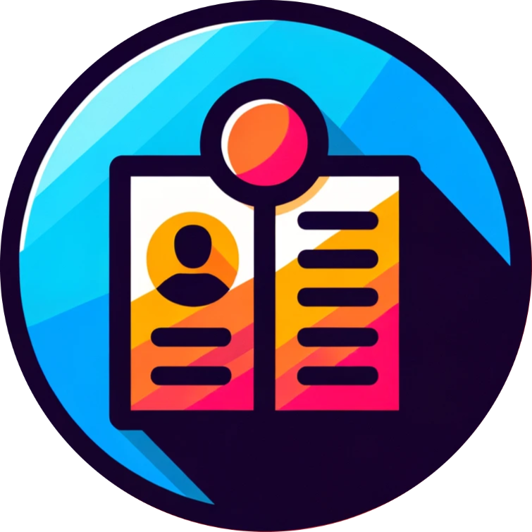

<a name="readme-top"></a>

<br />
<div align="center">
  <a href="https://github.com/Warrior-Wombat/fbla_mobile_nlc">
    
  </a>

<h3 align="center">Portfolio Perfecto</h3>

  <p align="center">
    Create anything you want.
    <br />
    <a href="https://github.com/Warrior-Wombat/fbla_mobile_nlc"><strong>Explore the docs »</strong></a>
    <br />
    <br />
    <a href="https://github.com/Warrior-Wombat/fbla_mobile_nlc/issues/new?labels=bug&template=bug-report---.md">Report Bug</a>
    ·
    <a href="https://github.com/Warrior-Wombat/fbla_mobile_nlc/issues/new?labels=enhancement&template=feature-request---.md">Request Feature</a>
  </p>
</div>

### Built With

* [![React][React.js]][React-url]
* [![Expo][Expo.dev]][Expo-url]

<!-- GETTING STARTED -->
## Getting Started

To get a local copy up and running follow these simple example steps.

### Prerequisites

* npm
  ```sh
  npm install npm@latest -g
  ```

### Installation
1. Clone the repo
   ```sh
   git clone https://github.com/Warrior-Wombat/fbla_mobile_nlc.git
   ```
2. Install Expo packages
   ```sh
   npx expo install
   ```
3. Configure dotenv file with appropriate credentials
4. Run app
   ```sh
   npx expo start
   ```

<p align="right">(<a href="#readme-top">back to top</a>)</p>

[React.js]: https://img.shields.io/badge/React-20232A?style=for-the-badge&logo=react&logoColor=61DAFB
[React-url]: https://reactjs.org/
[Expo.dev]: https://img.shields.io/badge/Build-fff.svg?style=for-the-badge&logo=EXPO&labelColor=fff&logoColor=000
[Expo-url]: https://expo.dev/
